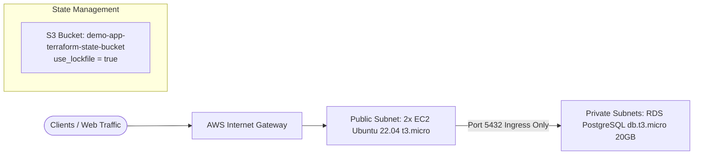

# Demo App - Infrastructure & CI/CD Repository

Welcome to the **demo-app** infrastructure and automation repository. This repository provides complete, production-ready Infrastructure as Code (IaC) written in Terraform and an automated CI/CD pipeline managed via Jenkins.

---

## Quick Navigation

* 📖 **[IaC Architecture & Provisioning Guide (iac/README.md)](file:///home/hao_pham/workspace/demo-app/iac/README.md)**: Full architectural documentation, visual charts, provisioning instructions, maintenance procedures, and troubleshooting FAQ.
* 🛠️ **[Development Infrastructure (iac/dev/)](file:///home/hao_pham/workspace/demo-app/iac/dev/)**: Terraform configuration tailored for the `dev` environment.
* 📦 **[Modular Infrastructure Baseline (terraform/)](file:///home/hao_pham/workspace/demo-app/terraform/)**: Parameterized Terraform templates for `non-prod` and `prod`.
* 🚀 **[Jenkins Pipeline (Jenkinsfile)](file:///home/hao_pham/workspace/demo-app/Jenkinsfile)**: Declarative pipeline supporting concurrency control, dynamic AWS credential bindings, and manual production approvals.

---

## Architectural Highlights

For detailed setup, charts, and provisioning instructions, please refer to **[iac/README.md](file:///home/hao_pham/workspace/demo-app/iac/README.md)**.
