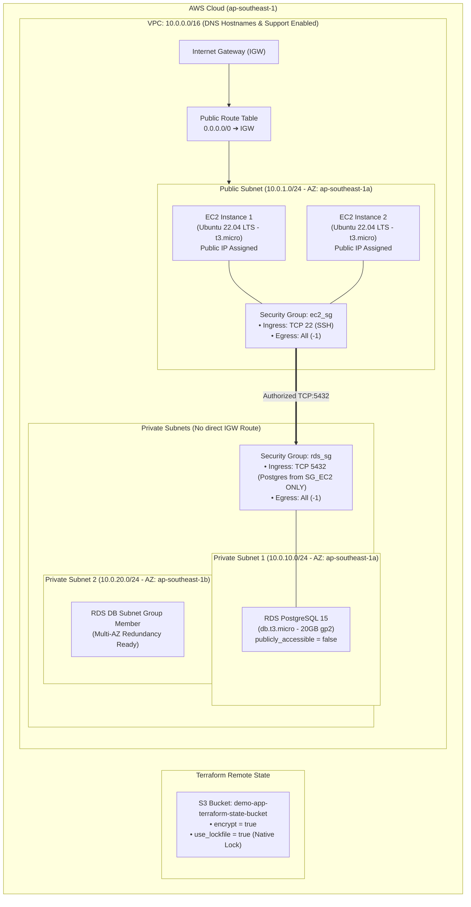
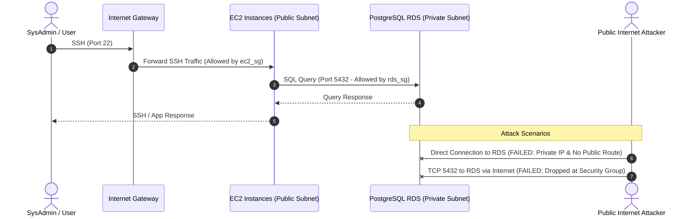
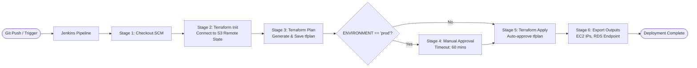

# Infrastructure as Code (IaC) - AWS Architecture & Provisioning Guide

This repository contains the Terraform Infrastructure as Code (IaC) configurations and CI/CD automation pipelines for provisioning, maintaining, and managing a secure, multi-tier AWS cloud infrastructure designed for the **demo-app**.

---

## 1. Purpose of the IaC Code

The primary objectives of this IaC codebase are:
* **Automated & Reproducible Infrastructure**: Eliminates manual configuration drift in the AWS Console through declarative Terraform code.
* **AWS Free-Tier Optimization**: Carefully sized resources (`t3.micro` EC2 instances, `db.t3.micro` PostgreSQL with 20GB storage) to minimize costs while maintaining high architectural standards.
* **Multi-Tier Network Isolation**: Isolates sensitive database workloads in private subnets across multiple Availability Zones, ensuring zero direct public Internet exposure.
* **State Management & Concurrency Safety**: Uses Amazon S3 remote state storage with native S3 state locking (`use_lockfile = true`, Terraform >= 1.10) to prevent state corruption without requiring extra DynamoDB tables.
* **Enterprise CI/CD Integration**: Supports multi-environment deployment (`non-prod` vs `prod`) via declarative Jenkins pipelines with role/credential isolation and mandatory manual approvals for production.

---

## 2. Infrastructure Architecture & Visual Charts

### 2.1 Network Topology & Resource Layout
The diagram below illustrates the Virtual Private Cloud (VPC), Subnets, Route Tables, Compute, and Database topology deployed in region `ap-southeast-1` (Singapore):



### 2.2 Traffic & Security Boundary Flow



### 2.3 CI/CD Provisioning Lifecycle Flow



---

## 3. Directory Structure

```
demo-app/
├── iac/
│   ├── README.md                 # This documentation file
│   └── dev/                      # Development environment configuration
│       ├── provider.tf           # Terraform binary requirements & S3 backend
│       ├── variables.tf          # Configurable variables & validation types
│       ├── network.tf            # VPC, Subnets, IGW, Route Tables, Security Groups
│       ├── main.tf               # Data AMI lookup & EC2 instances
│       ├── rds.tf                # RDS DB Subnet Group & PostgreSQL instance
│       ├── outputs.tf            # Exported infrastructure values (IPs, endpoints)
│       └── terraform.tfvars.example # Safe variable template (commit-friendly)
├── terraform/                    # Modularized baseline template (non-prod / prod)
│   ├── backend.tf
│   ├── variables.tf
│   ├── vpc.tf
│   ├── ec2.tf
│   ├── rds.tf
│   ├── outputs.tf
│   └── terraform.tfvars.example
├── Jenkinsfile                   # Declarative multi-environment CI/CD pipeline
└── .gitignore                    # Prevents leaking .tfstate, .tfvars & credentials
```

---

## 4. Prerequisites

Before provisioning infrastructure, ensure you have:
1. **Terraform CLI**: Version `>= 1.5.0` (Recommended `>= 1.10.0` for native S3 lockfile support).
2. **AWS CLI v2**: Configured with appropriate IAM permissions (VPC, EC2, RDS, S3).
3. **State Storage S3 Bucket**: An S3 bucket named `demo-app-terraform-state-bucket` created in `ap-southeast-1` with Bucket Versioning enabled.

---

## 5. How to Provision & Maintain

### 5.1 Local Provisioning (Step-by-Step)

#### Step 1: Navigate to the environment directory
```bash
cd iac/dev
```

#### Step 2: Configure Environment Variables
Create your `terraform.tfvars` from the example template:
```bash
cp terraform.tfvars.example terraform.tfvars
```
Edit `terraform.tfvars` and set a secure database password:
```hcl
aws_region  = "ap-southeast-1"
environment = "dev"
db_password = "YourSuperStrongPassword123!"
```

> [!TIP]
> Alternatively, supply the password via environment variable without writing it to disk:
> ```bash
> export TF_VAR_db_password="YourSuperStrongPassword123!"
> ```

#### Step 3: Initialize Terraform
Initializes provider plugins and connects to the S3 remote backend:
```bash
terraform init
```

#### Step 4: Validate and Preview the Plan
Format check and validate the syntax:
```bash
terraform fmt -check
terraform validate
```
Generate an execution plan:
```bash
terraform plan -out=tfplan
```

#### Step 5: Apply Infrastructure Changes
Apply the saved plan:
```bash
terraform apply tfplan
```

#### Step 6: Retrieve Outputs
After successful provisioning, inspect key infrastructure details:
```bash
terraform output
```
Example output:
```text
ec2_public_ips    = ["18.141.12.34", "54.255.56.78"]
public_subnet_id  = "subnet-0abc1234def5678"
rds_address       = "dev-postgres-db.c7x8y9z0.ap-southeast-1.rds.amazonaws.com"
rds_endpoint      = "dev-postgres-db.c7x8y9z0.ap-southeast-1.rds.amazonaws.com:5432"
vpc_id            = "vpc-0123456789abcdef"
```

---

### 5.2 Destroying Infrastructure
When the environment is no longer needed:
```bash
terraform plan -destroy -out=tfplan-destroy
terraform apply tfplan-destroy
```

---

### 5.3 Automated Maintenance via Jenkins CI/CD

The root [Jenkinsfile](file:///home/hao_pham/workspace/demo-app/Jenkinsfile) automates the provisioning workflow:

1. **Parameters**:
   * `ENVIRONMENT`: `non-prod` or `prod`.
   * `ACTION`: `apply` (deploy) or `destroy` (tear down).
2. **Credentials Setup in Jenkins**:
   * Create credentials of type **Username with password** (or AWS Credentials):
     * ID: `aws-nonprod-credentials-id` (Access Key as Username, Secret Key as Password).
     * ID: `aws-prod-credentials-id` (Access Key as Username, Secret Key as Password).
3. **Pipeline Stages**:
   * **Checkout**: Clones the latest branch.
   * **Terraform Init**: Connects to the remote S3 state.
   * **Terraform Plan**: Generates a deterministic `tfplan`.
   * **Manual Approval**: Automatically prompts the release manager **only when deploying to `prod`**.
   * **Terraform Apply**: Applies the approved plan file and outputs public IPs.

---

## 6. Maintenance & Operational Best Practices

### 6.1 State Locking & Recovery
* We use S3 native locking: `use_lockfile = true`.
* If a pipeline build crashes mid-apply, Terraform may hold an active lockfile on S3.
* To unlock state in an emergency:
  ```bash
  terraform force-unlock <LOCK-ID>
  ```

### 6.2 Managing AMI Updates
* The Ubuntu AMI lookup uses Canonical's latest release:
  ```hcl
  data "aws_ami" "ubuntu" {
    most_recent = true
    # ...
  }
  ```
* Canonical periodically releases patched AMIs. To prevent unexpected recreation of running EC2 instances during routine applies, an `ignore_changes` lifecycle rule is recommended on `aws_instance`:
  ```hcl
  lifecycle {
    ignore_changes = [ami]
  }
  ```

### 6.3 Database Security
* The PostgreSQL database has **no public IP** and is unreachable from the outside.
* To administer or run migrations on the database:
  1. SSH into one of the EC2 instances in the Public Subnet (acting as a bastion host).
  2. Connect using `psql` to `aws_db_instance.default.endpoint` over port `5432`.
  3. Or use AWS SSM Session Manager port forwarding to tunnel port `5432` securely to your local machine.

---

## 7. Troubleshooting FAQ

| Issue | Root Cause | Solution |
| :--- | :--- | :--- |
| `Error: Security group and subnet belong to different networks` | EC2 instance was missing explicit `subnet_id`. | Always define `subnet_id = aws_subnet.public.id` in `aws_instance`. |
| `Connection timed out` when SSHing to EC2 | Route table was not attached to Internet Gateway. | Verify `aws_route_table_association` links the public subnet to `aws_route_table.public`. |
| `DBSubnetGroupDoesNotCoverEnoughAZs` | RDS requires subnets in at least two different Availability Zones. | Ensure `private_1` is in AZ `a` and `private_2` is in AZ `b`. |
| `Error acquiring the state lock` | A concurrent pipeline or previous aborted run holds the lock. | Wait for the active run to finish, or verify no build is active before unlocking. |
